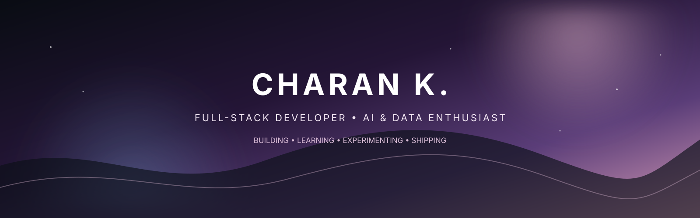
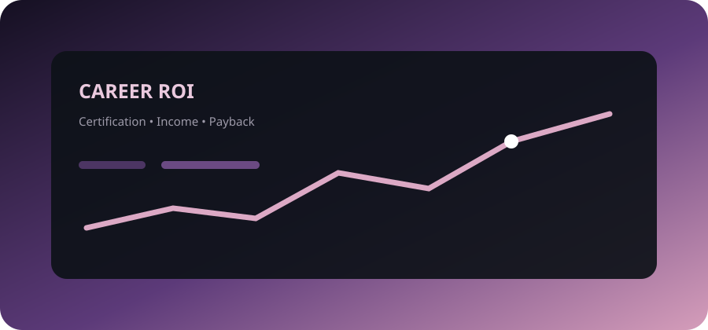
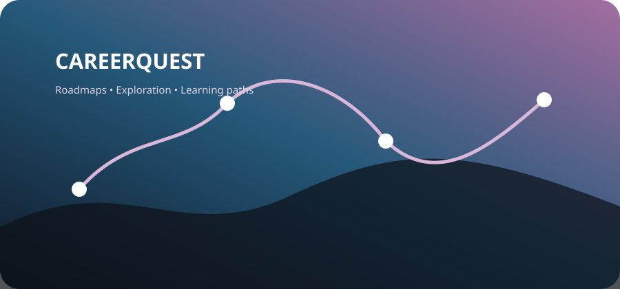
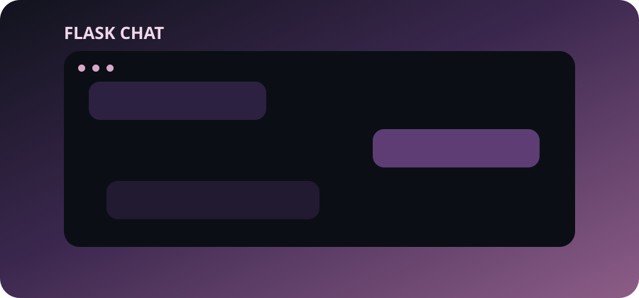
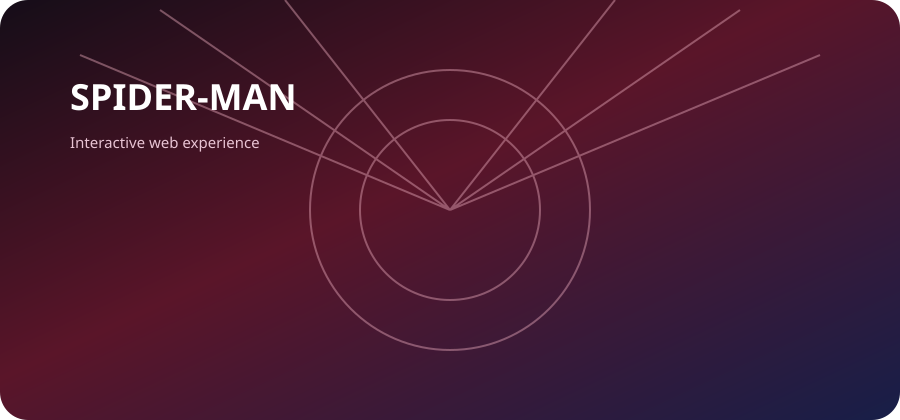

 

 

  

turning ideas into interfaces • APIs into products • data into insights

 

## ✦ about me

<table>

<tr>

<td width="65%" valign="top">

Hey, I'm **Charan** 👋

I'm an aspiring **Full-Stack Developer** focused on building practical web applications and learning how the pieces behind them fit together.

I enjoy moving between the frontend and backend: designing responsive interfaces, building APIs, connecting databases, working with data, and experimenting with AI-powered features.

### What I care about

🌐 **Modern web development**  

⚙️ **Backend systems & APIs**  

🗄️ **Databases & application architecture**  

📊 **Data analysis & visualization**  

🤖 **Practical AI/ML integration**  

I'm learning by building real projects, breaking things, fixing them, and shipping what I can.

</td>

<td width="35%" align="center">

  

<code>BUILD → LEARN → ITERATE</code>

</td>

</tr>

</table>

 

## ✦ tech stack

### frontend

  

### backend

  

### databases & services

  

### data

&nbsp;

  

### tools

 

## ✦ selected projects

<table width="100%">

<tr>

<td width="50%" valign="top">

### Career ROI Calculator

A career-focused web application that turns certification, income, cost, and comparison data into a simple ROI experience.

`React` `TypeScript` `Vite` `Supabase` `Vercel`

<a href="https://career-roi-calculator.vercel.app/">↗ Live demo</a>

</td>

<td width="50%" valign="top">

### CareerQuest

A career exploration and roadmap application built around discovering possible learning paths and organizing career information.

`React` `TypeScript` `Expo` `Firebase`

</td>

</tr>

<tr>

<td width="50%" valign="top">

### Flask Chat

A room-based chat application with authentication, private room codes, database persistence, and backend-driven communication.

`Python` `Flask` `SQLite` `SQLAlchemy`

</td>

<td width="50%" valign="top">

### Spider-Man Web Experience

An interactive themed web project exploring responsive layouts, frontend interaction, and mobile-friendly controls.

`HTML` `CSS` `JavaScript`

</td>

</tr>

</table>

 

## ✦ how i build

  

problem first • structure it • make it work • refine it • put it out

  

clean structure • responsive UI • useful features • readable code • continuous iteration

 

## ✦ currently learning

`FULL-STACK DEVELOPMENT` &nbsp; `BACKEND ARCHITECTURE` &nbsp; `AI / ML`  

`DATA VISUALIZATION` &nbsp; `SYSTEM DESIGN` &nbsp; `DEPLOYMENT`

 

## ✦ beyond code

> **build with curiosity · improve with consistency · ship with purpose**

I enjoy experimenting with new technologies, exploring interesting datasets,

turning ideas into projects, and learning through hands-on development.

 

🌱 learn &nbsp;&nbsp; • &nbsp;&nbsp; 🔍 explore &nbsp;&nbsp; • &nbsp;&nbsp; 💡 build &nbsp;&nbsp; • &nbsp;&nbsp; 🚀 ship

 

## ✦ let's connect

Open to **collaborations, development projects, internships, learning opportunities, and interesting technical problems.**

  

  

github.com/cherry5231 • kattacharan10flasmvp@gmail.com

  

