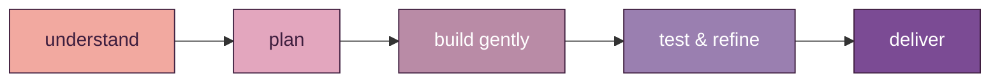

 

  

 

## ⋆ about me

<table width="88%">
<tr>
<td align="center">

I'm an aspiring software engineer who loves building **modern, reliable, and quietly delightful** applications — somewhere between clean interfaces, thoughtful backends, honest data, and a little bit of AI magic.

</td>
</tr>
</table>

 

🌸&nbsp; **frontend** — interfaces that feel calm to use &nbsp;|&nbsp;
🤍&nbsp; **backend & apis** — the quiet plumbing that just works &nbsp;|&nbsp;
🌿&nbsp; **data** — finding the story inside the numbers &nbsp;|&nbsp;
✩&nbsp; **ai** — making products feel a little more human

 

## ⋆ technologies

**frontend**
  

  

**backend & databases**
  

  

**data & ai**
  

&nbsp;&nbsp;

 

## ⋆ featured areas

<table width="90%">
<tr>
<td width="50%" valign="top" align="center">

🤍 **web applications**
 
responsive apps built with modern frameworks, reusable components, and clean, intuitive interfaces

</td>
<td width="50%" valign="top" align="center">

🌿 **data projects**
 
exploratory analysis, visual storytelling, and interactive dashboards from real-world datasets

</td>
</tr>
<tr><td colspan="2"> </td></tr>
<tr>
<td width="50%" valign="top" align="center">

🌸 **backend systems**
 
lightweight, scalable apis using python, flask, django & node, backed by solid database design

</td>
<td width="50%" valign="top" align="center">

✩ **ai-enhanced products**
 
web experiences enhanced with ai-powered tools, automation, and intelligent workflows

</td>
</tr>
</table>

 

## ⋆ how i build

simple & maintainable &nbsp;·&nbsp; responsive & accessible &nbsp;·&nbsp; clear structure &nbsp;·&nbsp; practical problem-solving &nbsp;·&nbsp; continuous learning

 

## ⋆ featured projects

<table width="95%">
<tr>
<td width="33%" valign="top" align="center">

🌸 **Project Name**
 
a short description of what the project does and the problem it solves
  
<i>react · typescript · node.js · rest api</i>
  
[code](https://github.com) · [live demo](#)

</td>
<td width="33%" valign="top" align="center">

🌿 **Project Name**
 
a data analysis / visualization project that turns raw data into meaningful insight
  
<i>python · pandas · numpy · matplotlib</i>
  
[code](https://github.com)

</td>
<td width="33%" valign="top" align="center">

✩ **Project Name**
 
an ai-enhanced application showing how intelligent features improve a web experience
  
<i>next.js · python · api · firebase</i>
  
[code](https://github.com)

</td>
</tr>
</table>

 

## ⋆ github, softly

  

> if a card above ever shows a broken image, it's the free stats API being rate-limited for a moment — refresh the page and it comes back.

 

## ⋆ currently learning

production-ready full-stack apps &nbsp;·&nbsp; system design & backend architecture &nbsp;·&nbsp; better data visualizations &nbsp;·&nbsp; practical ai integrations &nbsp;·&nbsp; scalable, maintainable code

 

## ⋆ beyond code

<table width="80%"><tr><td align="center">

<i>"good software is not only about writing code — it is about understanding people, solving meaningful problems, and creating experiences that feel simple."</i>

</td></tr></table>

 

When I'm not building applications, I enjoy exploring new technologies, experimenting with ideas, analyzing data, and finding better ways to solve everyday problems.

 

## ⋆ let's connect

open to learning opportunities, collaborations, and conversations about software development 🤍

  

  

<i>⋆｡°✩ build with curiosity, improve with consistency ✩°｡⋆</i>

