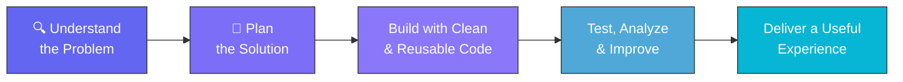

 

  

 

##  About Me

<table>
<tr>
<td>

I'm an aspiring software engineer who loves building **modern, reliable, and user-focused** applications. My work sits at the intersection of frontend engineering, backend systems, data analysis, and AI-powered experiences.

I enjoy turning ideas into functional products, learning new technologies, and continuously improving the way I build software.

</td>
</tr>
</table>

-  Frontend development — responsive, accessible, component-driven UIs
-  Backend & API development — services that connect apps to data
-  Data analysis & visualization — finding the story in the numbers
-  AI integration — making applications smarter and more personal
-  Clean, maintainable software design

 

##  What I Work With

<table width="100%">
<tr>
<td width="50%" valign="top">

###  Frontend

 

 

</td>
<td width="50%" valign="top">

### ⚙️ Backend

 

###  Databases

</td>
</tr>
<tr>
<td width="50%" valign="top">

### Data & Analysis

 

</td>
<td width="50%" valign="top">

###  AI Integration

 

</td>
</tr>
</table>

 

##  Featured Areas

<table width="100%">
<tr>
<td width="50%" valign="top">

###  Web Applications
Responsive apps built with modern frontend frameworks, reusable components, API integrations, and clean, intuitive interfaces.

</td>
<td width="50%" valign="top">

###  Data Projects
Exploratory analysis, visual storytelling, statistical insights, and interactive dashboards built from real-world datasets.

</td>
</tr>
<tr>
<td width="50%" valign="top">

###  Backend Systems
Lightweight, scalable APIs using Python, Flask, Django, and Node.js, backed by solid database design.

</td>
<td width="50%" valign="top">

###  AI-Enhanced Products
Web experiences enhanced with AI-powered tools, automation, and intelligent workflows.

</td>
</tr>
</table>

 

##  My Development Approach

**I value:** Simple & maintainable solutions · Responsive & accessible interfaces · Clear project structure · Practical problem-solving · Continuous learning · Good user experience

 

##  Featured Projects

<table width="100%">
<tr>
<td width="33%" valign="top">

###  Project Name
A short description of what the project does and the problem it solves.

**Built with:** `React` `TypeScript` `Node.js` `REST API`

</td>
<td width="33%" valign="top">

###  Project Name
A data analysis/visualization project that transforms raw data into meaningful insights.

**Built with:** `Python` `Pandas` `NumPy` `Matplotlib`

</td>
<td width="33%" valign="top">

###  Project Name
An AI-enhanced application demonstrating how intelligent features can improve a web experience.

**Built with:** `Next.js` `Python` `API` `Firebase`

</td>
</tr>
</table>

 

##  GitHub Statistics

 

 

##  Currently Learning

  

##  Beyond Code

> Good software is not only about writing code — it is about understanding people, solving meaningful problems, and creating experiences that feel simple.

When I'm not building applications, I enjoy exploring new technologies, experimenting with ideas, analyzing data, and finding better ways to solve everyday problems.

 

##  Let's Connect

I'm open to learning opportunities, collaborations, interesting projects, and conversations about software development.

  

### *"Build with curiosity. Improve with consistency."*

